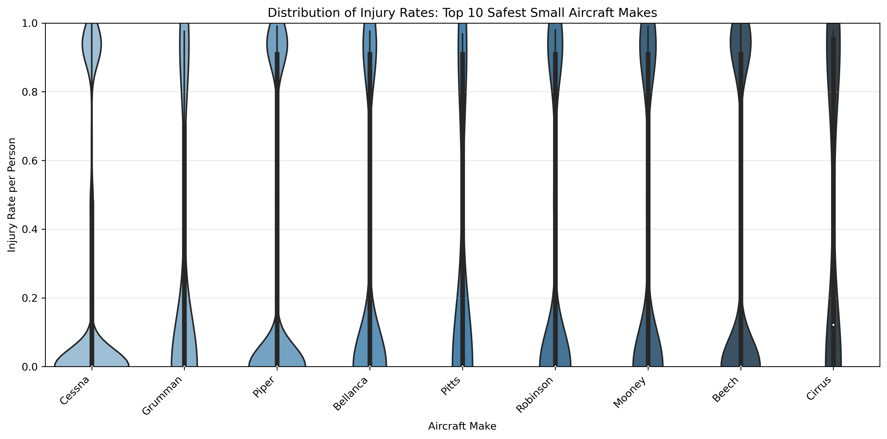
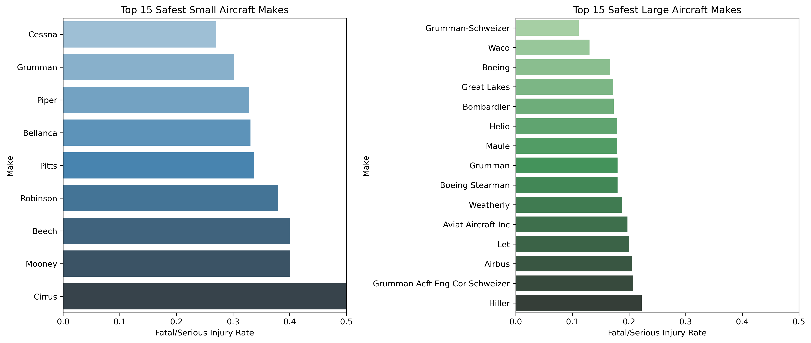
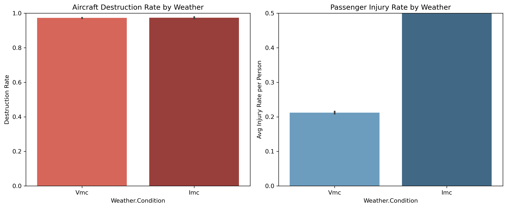

# Aviation Accidents Safety Analysis

## Project Overview
This analysis examines aviation accident data (1983-2023) to identify aircraft makes/models with the lowest rates of total destruction and passenger injuries. The client (an airline/aircraft insurer) requested separate recommendations for small and large aircraft.

## Key Findings

### 🏆 Safest Aircraft Makes

**Small Aircraft:**
- **Cessna**: 27% injury rate, 98% destruction rate
- **Piper**: 33% injury rate, 99% destruction rate
- **Grumman**: 30% injury rate, 99% destruction rate

**Large Aircraft:**
- **Boeing**: 17% injury rate, 55% destruction rate
- **Airbus**: 13-49% injury rate, 34-49% destruction rate
- **Bombardier**: Lowest destruction rate among large aircraft

### 📊 Factor Analysis

**1. Weather Condition:**
- IMC (poor weather) shows higher destruction and injury rates than VMC
- Visual flight conditions are significantly safer

**2. Phase of Flight:**
- Takeoff and Landing phases show distinct risk profiles
- Cruise phase has different injury patterns

## Methodology
- Filtered data to professional aircraft from 1983 onwards (40-year max lifetime)
- Created `injury_rate_per_person` metric: (fatal + serious injuries) / total passengers
- Created `was_destroyed` binary indicator for total destruction
- Minimum sample size of 30 accidents per make/model for statistical robustness
- Separated aircraft into small (≤20 passengers) and large (>20 passengers) categories

## Key Visualizations

### Injury Rate Distribution - Small Aircraft

### Safest Makes Comparison

### Weather Impact

## Files
- `Aviation_Accidents_Cleaning.ipynb`: Data cleaning and preprocessing
- `Aviation_Accidents_Data_Analysis.ipynb`: Exploratory analysis and visualizations
- `data/`: Raw and cleaned datasets

## Recommendations
1. **For small aircraft insurance**: Prioritize Cessna and Piper models
2. **For large aircraft insurance**: Boeing and Airbus show superior safety profiles
3. **Risk factors**: Weather conditions and flight phase significantly impact outcomes
4. **High destruction rates** in small aircraft reflect structural vulnerability, not necessarily passenger risk

---
*Analysis completed: April 2026*

